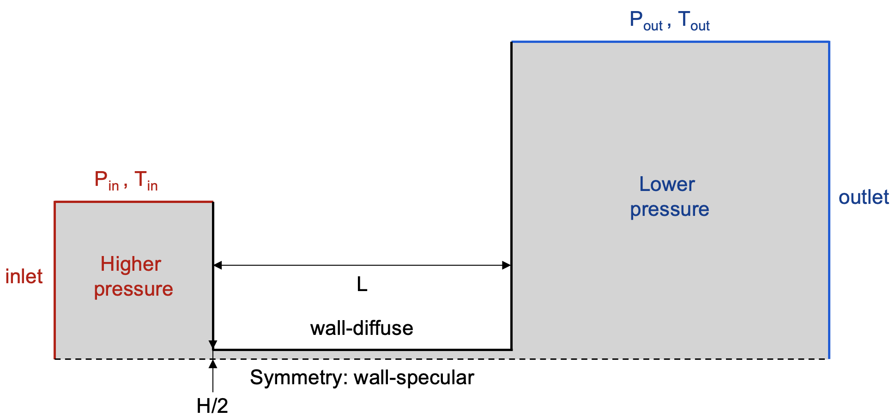
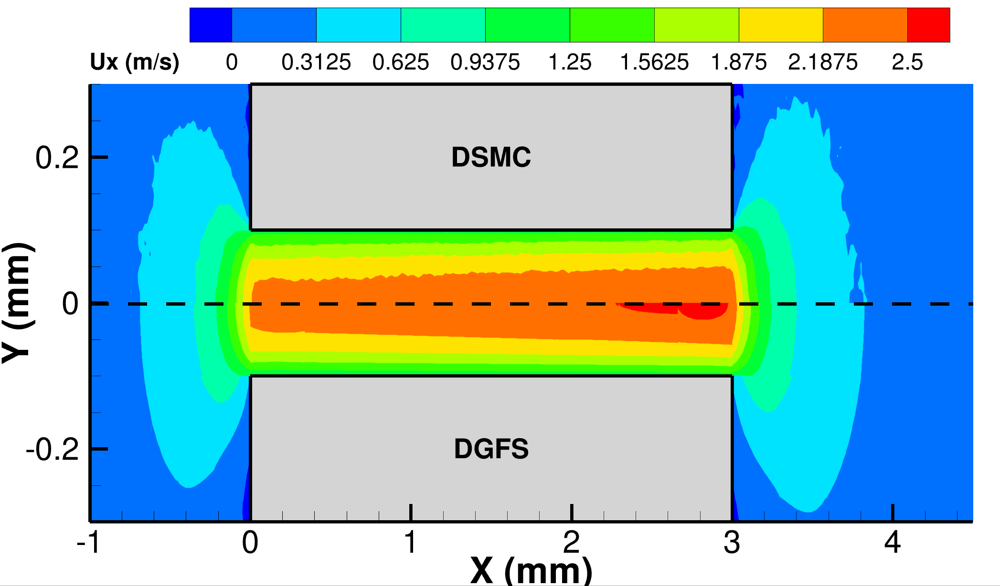
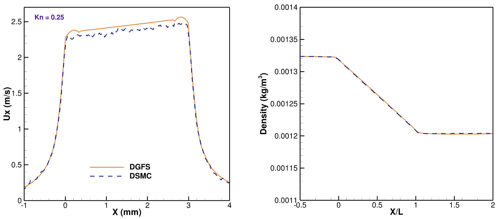

# 2D Pressure Driven Microchannel Flow Test Case 
This test case considers the effect of flow in the microchannel induced by pressure gradients. Simulating rarefied flow in micro or milli channels is crucial for various applications such as microfluidics, gas-based sensors, vacuum systems, MEMS devices, and aerospace engineering, in order to optimize performance and improve efficiency in these fields. Understanding rarefied gas behavior in a channel helps predict fluid flow patterns, pressure drops, heat transfer rates, and aerodynamic characteristics, enabling researchers and engineers to create more effective devices and systems at the micro or millimeter scale.

## Test Case Characteristics 
In this test case, we use Nitrogen as the working gas. There are three different file endings used: .ini, .geo, and .msh, that are required to run the DGFS solver. The .ini file is the input file for the solver, the .geo file provides the description of the geometry for the mesh generation using the Gmsh software, and the .msh file is the mesh from the Gmsh software. 

### Geometry File 
A file with the extension .geo represents a format that contains both geometry and mesh information. Schematic geometry for the microchannel test case is shown in the picture below: the half of the geometry was used due to the symmetry of the problem. The length of the channel is L = 1.5 mm, and half of the channel width is  H0/2 = 0.1 mm. The pressure ratio is P_in/P_out=1.1.

In this particular case, a non-dimensional geometry was created in the .geo file, and each line of the geometry (Physical Line) was assigned a specific name to represent different boundary conditions (Inlet, Outlet, Wall, Symmetry). The actual boundary conditions themselves are defined in the .ini file. Additionally, all non-dimensional parameters including length are set in the .ini file.

Different meshes were used in order to conduct a mesh refinement study, aiming to achieve the desired accuracy. After evaluating multiple mesh configurations, a final mesh was selected that met the desired accuracy criteria. The results presented in this section correspond to the final mesh with 8 x 2 elements in the microchannel that achieved the desired accuracy.

### Input File 
The .ini file includes physical and numerical parameters for this test case. Starting from the top of the file, the section **[non-dim]** includes the non-dimensional units of temperature (T0), channel thickness (H0), and density (rho0). In this problem, an average density of input and output parameters was used as the density for dimensionalization, denoted as rho0. The molecular weight of the working gas (MW) is also included.

The molecular model parameters are defined in the **[scattering-model]** section. This test case for both DGFS and DSMC solutions utilizes a variable hard sphere (VHS) scatter model and the VHS parameters are provided in the input file which include viscosity index (omega), reference diameter (dRef), and reference temperature (Tref). The VHS parameters are found in the Appendix of  [[1]](#1).

The order of the spatial accuracy of the solver is specified in the section solver **[solver]**. This test case uses a DG order of 2. The time integration parameters are included in the section **[solver-time-integrator]**. The type of time solver is given as dgfs-euler. Further, the start time (tstart), end time (tend), and time-step (dt) are given. Note that tend and dt are nondimensionalized units that denote an explicit Euler time integration. The initial conditions are given in the section **[soln-ics]** as linear variations of density (rho), temperature (T), x-velocity (ux), y-velocity (uy), and z-velocity (uz) between the inlet and outlet boundaries. The last six sections **[soln-bcs-left]**, **[soln-bcs-right]**, **[soln-bcs-wall-left]**, **[soln-bcs-wall-middle]**, **[soln-bcs-wall-right]**, **[soln-bcs-symmetry]** specify the boundary conditions. 

## Flow Visualization 
The image below provides a comparison between pressure-driven flow in microchannel using the DGFS solver and DSMC solver for Kn = 0.25. The image demonstrates clear alignment between the two solvers: both methods predict a qualitatively similar flowfield (except statistical noise when using DSMC method) from the left reservoir to the right one.The streamwise velocity magnitude inside the channel predicted by the DGFS method is also quantitatively similar to the DSMC method. The macroscopic properties of density and velocity on the symmetry line are plotted. 
 

  

For the DSMC simulation, a cell size smaller than λ/3 has been ensured, and a 450 x 150 grid was used for the entire domain. A minimum of 30 DSMC simulator particles per cell were used with Fnum = 8e+9 (a higher value of Fnum showed a higher level of statistical noise) and timestep dt = 1e-7 s. The DSMC simulation was run for 200,000 iterations in total, and the final result was averaged over 100,000 steps to minimize statistical noise.

## References
<a id="1">[1]</a> 
Bird, Graeme Austin. Molecular Gas Dynamics. Oxford: Clarendon Press, 1976. Print.
