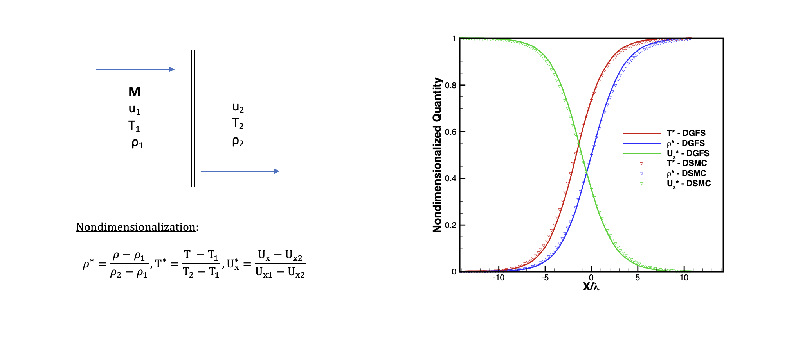

# 1 Dimensional Normal Shock Flow Case
This test case involves a one-dimensional normal shock problem. Shock waves are an important concept in the field of aerospace engineering and play an important role in the development of supersonic engines, turbomachinery, supersonic vehicle surfaces, rockets, missiles, and reentry vehicles. 

## Test Case Characteristics 
In this test case, we use Helium as the working gas. There are three different file endings used: .ini, .geo, and .msh, that are required to run the DGFS solver. The .ini file is the input file for the solver, the .geo file provides the description of the geometry for the mesh generation using theb Gmsh software, and the .msh file is the mesh from the Gmsh software.  
### Input File 
The .ini file includes physical and numerical parameters for this test case. Starting from the top of the file, the section **[non-dim]** includes the nondimensional units of temperature (T0), shock thickness (H0), and density (rho0). The molecular weight of the working gass (MW) is also included. The molecular model parameters are defined in the **[scattering-model]** section. This test case utilizes the VHS model and the VHS parameters are provided in the input file which include viscosity index (omega), reference diameter (dRef), and reference temeprature (Tref). The VHS parameters are found in the Appendix of  [[1]](#1). The order of the spatial accuract of the solver is specified in the section solver **[solver]**. This test case uses a DG order of 2. The time intergation parameters are inlcuded in the section **[solver-time-integrator]**. The type of time solver is given as dgfs-euler. Further, the start time (tstart), end time (tend), and time-step (dt) are given. Note that tend and dt are nondimensionalized units that denote an explicit Euler time integration. The initial conditions are given in the section **[soln-ics]** as linear variations of density (rho), temperature (T), x-velocity (ux), y-velocity (uy), and z-velocity (uz) between the upstream and downstream of the shock. The last two sections **[soln-bcs-left]** and **[soln-bcs-right]** specifies the upstream and downstrea conditions of the shock. 

### Geometry File 
The .geo file includes the geometry defintions of to be used by the Gmsh program. At the top of the file, the nondimensional length (H0), the height of the nondimensionalized domain (H), and the length of the domain (L) are defined. Further, the number of cells defined in the x and y directions are defined as nVertexX and nVertexY, respectively. 

## Flow Visualization 
The image below provides a schematic of the problem with the defined macroscopic properties required by the solver. The image next to the schematic is a comparison between a Helium shock using the DGFS solver and DSMC solver. The image demonstrates clear allignment between the two solvers. 

## References
<a id="1">[1]</a> 
Bird, Graeme Austin. Molecular Gas Dynamics. Oxford: Clarendon Press, 1976. Print.

